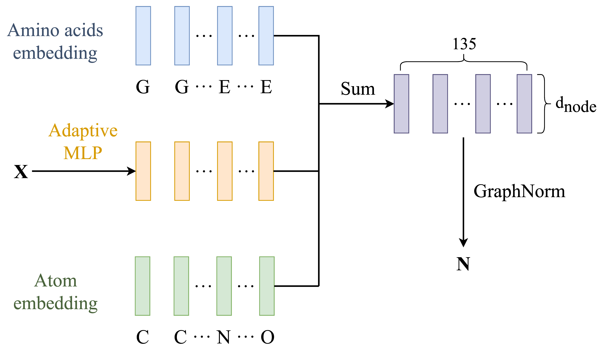
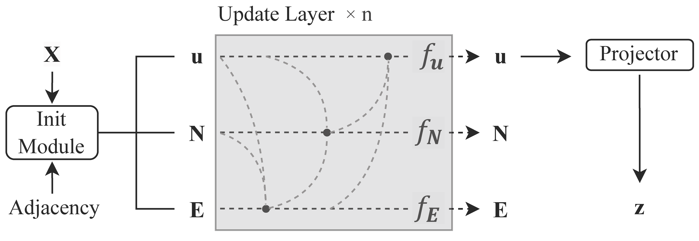

***Note: This English translation is provided by Claude AI assistant. It is for reference only. For accurate and authoritative information, please refer to the original Chinese readme file or send me an email.***

# Protein Clustering Analysis Based on Contrastive Learning  

This is my ***graduation project***. The main files in this project are:

1. `preprocess.ipynb`: Used for data preprocessing to convert the data into the format we need.

2. `modeling_grad.py`: Includes dataset structure, graph neural network structure, SwAV contrastive learning implementation, and provides a `train_model` function for convenient parameter settings during training.

3. `run.py`: Build dataset, train model and save model parameters.

## Abstract
Molecular dynamics (MD) simulation has been widely used to study proteins’
thermodynamic and dynamic behavior. However, MD trajectories typically contain a massive 
amount of protein conformations, which is highly challenging to extract critical information
related to biophysical processes, such as the free energy landscape and critical stable structures, 
from this massive data. This study uses graph neural networks and contrastive learning methods 
to overcome the challenges of analyzing proteins’ MD trajectories. Based on the characteristic 
of many unlabeled data in MD trajectories, we designed and trained a graph neural network 
model using the unsupervised contrastive learning method SwAV. The model can take the 
Cartesian coordinates of the constituent atoms of proteins as inputs, reduce the dimensionality 
of protein conformation information to any dimension, and perform end-to-end clustering 
analysis. To validate the effectiveness of our method, we conducted a series of studies using the 
MD trajectory of alanine dipeptide. The results showed that our approach could learn physically 
meaningful representations of protein conformations without prior domain knowledge of 
protein conformation domains. Finally, we provided an example of using our method to analyze 
the potential high-energy conformations of Mini-G proteins. This study preliminarily indicates 
that graph neural networks and contrastive learning methods have potential application value 
in the analysis of MD trajectories.

**Key Words: protein conformation; clustering analysis; graph nerual network; contrastive 
learning**

## `preprocess.ipynb`
Required Python packages: `torch`, `tokenizers`, `numpy`, `matplotlib`

This file is mainly used for data preprocessing to convert the data into the format we need (including atom information, amino acid information and connectivity information) for building our dataset in subsequent files.

Required files: Cartesian coordinates of required atoms in npy format (can be extracted from traj files)

Parts that need modification:

1. Line 1 in the second code block `np.load('xxx.npy')` should be changed to the filename that stores all the Cartesian coordinates of atoms.

2. Line 2 in the second code block `atom_type` should be changed to the types of each atom in the molecule to study. 

3. Line 3 in the second code block `aa_type` should be changed to the amino acid type that each atom in the molecule to study belongs to.

4. Line 4 in the second code block `connections` is a list where each element represents which atoms the atom is connected to. It can be obtained in VMD using the command `[atomselect top all] getbonds`.

5. The rest of the contents do not need to be modified, just run through.

Output files:

1. `edge_index.pt`: Connectivity information 

2. `aa_inputs.pt`: Tokenized amino acid type inputs

3. `atom_inputs.pt`: Tokenized atom type inputs

4. `pt_coords.pt`: Required atoms' Cartesian coordinates

## `modeling_grad.py`
Required Python packages: `torch_geometric`, `torch`, `numpy`

This file includes dataset structure, graph neural network structure, SwAV contrastive learning implementation, and provides a `train_model` function for convenient parameter settings during training. 

If you just want to run the code, you don't need to delve into the specific code implementation in this file. The parts related to parameter settings will be introduced in `run.py`.

### Graph Neural Network Structure



As shown above, the initialization module maps the Cartesian coordinates, atom information and amino acid information to node_dim dimensional vectors for initializing N (node features) in GNN. N will be further used to initialize E (edge features) with dimension edge_dim in GNN. E initializes u (global features) with dimension global_dim. Specific steps can be found in lines 116 and 154 in `modeling_grad.py`. These dimensions can all be conveniently set as described in the next section `run.py`.

Projector is an experimentally proven effective trick. Its role is to map u to a higher dimension proj_hidden_dim, then gradually compress it to a lower dimension proj_output_dim, e.g. 64 → 128 → 32 → 8. The specific structure of Projector can be found in line 478 in `modeling_grad.py`.



The above figure shows a schematic diagram of the overall graph neural network architecture. The small black dots indicate aggregation and update of information, the dotted lines indicate the source of information, from left to right representing the order of aggregation and update, i.e. E→N→u. What happens in each update step can be found starting from lines 246, 289, 341 in `modeling_grad.py`.

### SwAV Method
Please refer to the original paper [SwAV paper](https://arxiv.org/abs/2006.09882v5 "https://arxiv.org/abs/2006.09882v5")

## `run.py`

This file is mainly used to train the model with all parameters set here. 

```python
# Line 20 PATH may need to be changed to the path storing the corresponding data
PATH = r"./data"  
atom_inputs = torch.load(f"{PATH}/atom_inputs.pt")
aa_inputs = torch.load(f"{PATH}/aa_inputs.pt")
edge_index = torch.load(f"{PATH}/edge_index.pt")
cartesian_coord = torch.load(f"{PATH}/coords.pt")
cartesian_coord = (cartesian_coord  
                   - cartesian_coord.sum(dim=1, keepdim=True) / cartesian_coord.shape[1]) # Center
```

```python 
# Line 44, set model architecture
model = SwavMoleculeTrain(
    num_atom=num_atoms,  # Automatically set based on data 
    num_aa=num_aa, # Automatically set based on data
    coord_inputs_dim=3, # Fixed to 3
    node_dim=64, # Node attribute dimension in GNN, see "Graph Neural Network Structure" for details
    edge_attr_dim=64, # Edge attribute dimension in GNN 
    global_attr_dim=64, # Global attribute dimension in GNN
    dropout_prob=0.0, # Suggest 0
    num_layers=12, # Number of GNN layers
    num_prototypes=num_prototypes, # Number of prototypes, i.e. cluster centers
    use_projector=True, # Suggest True 
    proj_hidden_dim=256, # Dimension of the first fully connected layer in projector, see line 478 in modeling_grad.py for projector structure
    proj_output_dim=proj_output_dim, # Final output dimension of projector
    norm_type="graphnorm", # Suggest "graphnorm", other options are batchnorm and layernorm
)
```

```python
# Line 64, set some hyperparameters
batch_size = 512 # Set based on GPU memory 
num_epochs = 100 # Can modify
temperature = 0.25 # Can try 0.05 to 0.25
lr = 4.8e-2 # Can modify
```

```python  
# Lines 93-101, optimizer and scheduler settings, usually do not need modification
optimizer = torch.optim.SGD(model.parameters(), lr=1, momentum=0.9, weight_decay=1e-6) # weight_decay can modify
scheduler = get_cos_lr_scheduler(
    optimizer, warmup_steps=0.1 * num_epochs * len(train_loader),
    total_steps=num_epochs * len(train_loader), 
    warmup_init_lr=0.1 * lr,
    max_lr=lr,
    min_lr=1e-3 * lr # Can modify
)
optimizer = LARC(optimizer=optimizer, trust_coefficient=0.001, clip=False)
```

```python
# Line 103, model save path, can also change to other forms  
savepath = (f'./c{num_prototypes}'
            f'_d{proj_output_dim}_{temperature}' 
            f'_eps0.05_LARS_{lr}') 
```

```python
# Lines 110, train_model function, start model training and return loss, usually do not need modification, just pass the set contents to this function and start training
# See line 734 in modeling_grad.py for details of the training loop
loss, eval_loss = train_model(
    model, # model here does not have to be the GNN above, can design other networks  
    optimizer=optimizer,
    scheduler=scheduler, 
    train_loader=train_loader,
    eval_loader=eval_loader,
    num_epochs=num_epochs,
    device=device,
    temperature=temperature,
    use_fp16=True, # mixed precision computation, suggest True
    sinkhorn_eps=0.05, # epsilon in sinkhorn algorithm, suggest no change
)
```

## How to Load Trained Model Parameters
Can refer to `visualization.ipynb`, it is a program for visualization and plotting, is not written very formally, just for reference. It demonstrates how to load trained model parameters and obtain clustering results.

### Load Model Parameters
```python
num_atoms = dataset[0][0].unique().size(0) 
num_aa = dataset[0][1].unique().size(0)
num_prototypes = 4
# Note here we use SwavMolecule model, SwavMoleculeTrain was used during training
# Parameter settings need to match training, otherwise there will be errors
model = SwavMolecule(  
    num_atom=num_atoms,
    num_aa=num_aa,
    coord_inputs_dim=3,
    node_dim=64,
    edge_attr_dim=64, 
    global_attr_dim=64,
    dropout_prob=0.0,
    num_layers=12,
    num_prototypes=num_prototypes,
    use_projector=True,
    proj_hidden_dim=128,
    proj_output_dim=8,
    norm_type="graphnorm",
)

ROOT = "./" # May need to change to path storing checkpoints
ckpt_path = ROOT + "swav_mole.pth" 
model.load_state_dict(torch.load(ckpt_path)['model']) # Loading complete
```

### Get Clustering Results and Features
```python
cluster_all = torch.empty((0))  
u_all = torch.empty((0, 8)) # Shape should match proj_output_dim

for batch in tqdm(dataloader, total=len(dataloader)):
    model.eval()
    atom_id, amino_acids_id, data_batch = batch
    batch_size = atom_id.size(0)
    edge_index = data_batch.edge_index
    x = data_batch.x
    with torch.no_grad():
        res = model(
            x.to(device),
            atom_id.to(device),
            amino_acids_id.to(device),
            edge_index.to(device) 
        )
        # See lines 634+ in modeling_grad.py
        # Can also modify code for model to output additional features like encoder output
        
        scores = res['scores'].cpu()
        u = res['features'].cpu()

        z = u / u.norm(dim=1, keepdim=True, p=2)
        p = torch.nn.functional.softmax(scores / temperature, dim=-1)
        
        # Get clustering results  
        cluster = torch.argmax(p, dim=1)
        cluster_all = torch.concat((cluster_all, cluster), dim=0)

        u_all = torch.concat((u_all, u), dim=0)
```
