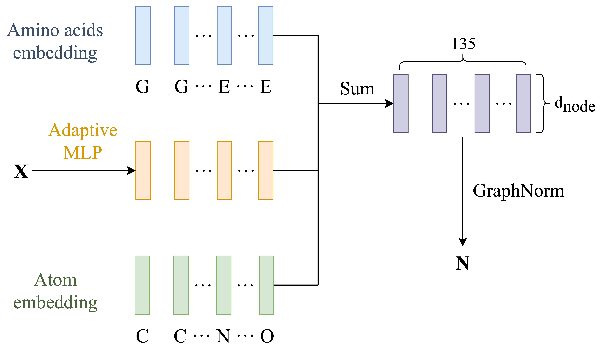

# 基于对比学习的蛋白质聚类分析
我的毕设。本项目主要包括三个文件  
1. `preprocess.ipynb`: 用于预处理数据，将数据转化为我们需要的形式。
2. `modeling_grad.py`: 包括了数据集的结构、图神经网络的结构、对比学习方法SwAV的实现以及提供了一个`train_model`函数方便地进行训练过程中的参数设置。
3. `run.py`: 建立数据集，训练模型并保存模型的参数。

## `preprocess.ipynb`
必要的python库: `torch`, `tokenizers`, `numpy`, `matplotlib`<br>

这个文件主要用于预处理数据，将数据转化为我们需要的形式（包括原子信息，氨基酸信息以及连接性信息），以便在后续文件中构建我们的数据集。

需要的文件：npy格式的所需原子的笛卡尔坐标（可以从轨迹文件.traj中提取）

需要修改的地方：
1. 第二个代码块的第1行`np.load('xxx.npy')`更改为对应的储存有所有原子笛卡尔坐标的文件名。
2. 第二个代码块的第2行`atom_type`更改为想要研究分子的每个原子的种类。
3. 第二个代码块的第3行`aa_type`更改为想要研究分子的每个原子所属的氨基酸种类。
4. 第二个代码块的第4行`connections`, 是一个列表，每个元素代表该原子与哪些原子相连，可以在VMD中使用命令`[atomselect top all] getbonds`获取。
5. 之后的内容不需要修改，全部运行下去就行。

最终得到的文件：
1. `edge_index.pt`: 连接性信息
2. `aa_inputs.pt`: tokenized氨基酸种类输入
3. `atom_inputs.pt`: tokenized原子种类输入
4. `pt_coords.pt`: 所需原子的笛卡尔坐标


## `modeling_grad.py`
必要的python库: `torch_geometric`, `torch`, `numpy`<br>

这个文件包括了数据集的结构、图神经网络的结构、对比学习方法SwAV的实现以及提供了一个`train_model`函数方便地进行训练过程中的参数设置。

如果只是想运行代码，那么不需要深究此文件中具体的代码实现，与参数设置相关的部分会在`run.py`中介绍。

### 图神经网络结构

如上图，初始化模块将笛卡尔坐标、原子信息与氨基酸信息映射至node_dim维的向量，用于初始化GNN中的N(结点特征), N会被进一步用于初始化GNN中edge_dim维的E(边特征), E初始化global_dim维的u(全局特征), 具体步骤可参考论文及`modeling_grad.py`中116, 154行内容，这些维度都可以被方便的进行设置，详见下一部分`run.py`中的第二个代码块

Projector是一个被实验认为有效的trick, 其作用是将u映射到较高的维度proj_hidden_dim, 再逐步压缩到较低的维度proj_output_dim, 例如, 64 → 128 → 32 → 8, Projector具体结构可参考 `modeling_grad.py`中478行内容


上图是图神经网络总体结构的示意图。小黑点表示发生了信息的汇聚并进行了信息的更新，虚线表示信息的来源，从左至右代表了汇聚及更新的顺序，即E→N→u的顺序。具体每个更新步骤中发生了什么可以参考论文及`modeling_grad.py`中246, 289, 341行开始的内容。

### SwAV方法
请参考原论文[SwAV 论文地址](https://arxiv.org/abs/2006.09882v5 "https://arxiv.org/abs/2006.09882v5")

## `run.py`

这个文件主要用于训练模型，所有参数均在这里设置。

```python
# 第20行PATH可能需要修改至对应的储存了相应的数据的路径
PATH = r"./data"
atom_inputs = torch.load(f"{PATH}/atom_inputs.pt")
aa_inputs = torch.load(f"{PATH}/aa_inputs.pt")
edge_index = torch.load(f"{PATH}/edge_index.pt")
cartesian_coord = torch.load(f"{PATH}/coords.pt")
cartesian_coord = (cartesian_coord 
                   - cartesian_coord.sum(dim=1, keepdim=True) / cartesian_coord.shape[1])  # 中心化
```

```python
# 第44行，设置模型的架构
model = SwavMoleculeTrain(
    num_atom=num_atoms,  # 自动根据数据生成
    num_aa=num_aa,  # 自动根据数据生成
    coord_inputs_dim=3,  # 固定是3
    node_dim=64,  # GNN中结点属性的维度，若要了解GNN细节请看“图神经网络结构”
    edge_attr_dim=64,  # GNN中边属性的维度
    global_attr_dim=64,  # GNN中全局属性的维度
    dropout_prob=0.0,  # 建议设置为0
    num_layers=12,  # GNN层数
    num_prototypes=num_prototypes,  # prototypes的数量，即聚类中心个数
    use_projector=True,  # 建议True
    proj_hidden_dim=256,  # projector中第一个全连接层的维度，关于projector的结构请看modeling_grad.py中的478行
    proj_output_dim=proj_output_dim,  # projector中最终输出的维度
    norm_type="graphnorm",  # 建议使用"graphnorm"，其他可选项为batchnorm和layernorm
)
```

```python
# 64行，设置一些超参数
batch_size = 512  # 根据显存设置
num_epochs = 100  # 可以改
temperature = 0.25  # 可以尝试从0.05到0.25
lr = 4.8e-2  # 可以改
```

```python
# 93行到101行，优化器和scheduler设置，基本不需要修改
optimizer = torch.optim.SGD(model.parameters(), lr=1, momentum=0.9, weight_decay=1e-6)  # weight_decay可以改
scheduler = get_cos_lr_scheduler(
    optimizer, warmup_steps=0.1 * num_epochs * len(train_loader), 
    total_steps=num_epochs * len(train_loader),
    warmup_init_lr=0.1 * lr,
    max_lr=lr,  
    min_lr=1e-3 * lr  # 这个可以改
)
optimizer = LARC(optimizer=optimizer, trust_coefficient=0.001, clip=False)  
```

```python
# 103 行, 模型的储存目录，也可以更改为其他形式
savepath = (f'./c{num_prototypes}'
            f'_d{proj_output_dim}_{temperature}'
            f'_eps0.05_LARS_{lr}')
```

```python
# 110行，train_model函数，开始模型的训练并返回loss，基本不需要改动，只是将之前设置好的内容传入这个函数并开始训练
# 若想了解training loop中的细节请查看modeling_grad.py中的734行
loss, eval_loss = train_model(
    model,  # 这里的model也不一定要使用上面的GNN，可以设计别的网络
    optimizer=optimizer,
    scheduler=scheduler,
    train_loader=train_loader,
    eval_loader=eval_loader,
    num_epochs=num_epochs,
    device=device,
    temperature=temperature,  
    use_fp16=True,  # 混合精度计算，建议True
    sinkhorn_eps=0.05,  # sinkhorn算法中的epsilon，建议不改
)
```

## 如何载入已经训练好的模型参数
可以参考`visualization.ipynb`，这是用于可视化画图的程序，写的不是很规范，仅供参考，用这部分程序，介绍如何载入训练好的模型参数以及获得聚类结果

### 载入模型参数
```python
num_atoms = dataset[0][0].unique().size(0)
num_aa = dataset[0][1].unique().size(0)
num_prototypes = 4
# 这里要注意，使用SwavMolecule这个模型，训练的时候使用的是SwavMoleculeTrain
# 参数的设置要和训练时的一致，否则会报错
model = SwavMolecule(
    num_atom=num_atoms,
    num_aa=num_aa,
    coord_inputs_dim=3,
    node_dim=64,
    edge_attr_dim=64,
    global_attr_dim=64,
    dropout_prob=0.0,
    num_layers=12,
    num_prototypes=num_prototypes,
    use_projector=True,
    proj_hidden_dim=128,
    proj_output_dim=8,
    norm_type="graphnorm",
)  

ROOT = "./"  # 可能要更改为对应的储存有checkpoint的路径
ckpt_path = ROOT + "swav_mole.pth"
model.load_state_dict(torch.load(ckpt_path)['model'])  # 载入完成
```

### 获取聚类结果与特征
```python
cluster_all = torch.empty((0))
u_all = torch.empty((0, 8))  # 这里形状要设置为和proj_output_dim一样

for batch in tqdm(dataloader, total=len(dataloader)):
    model.eval()
    atom_id, amino_acids_id, data_batch = batch
    batch_size = atom_id.size(0)
    edge_index = data_batch.edge_index
    x = data_batch.x
    with torch.no_grad():
        res = model(
            x.to(device), 
            atom_id.to(device), 
            amino_acids_id.to(device), 
            edge_index.to(device)
        )
        # 参考modeling_grad.py中的634开始的内容
        # 也可以修改代码使模型输出额外的特征，如编码器（即GNN）的输出
        scores = res['scores'].cpu()  
        u = res['features'].cpu()

        z = u / u.norm(dim=1, keepdim=True, p=2)
        p = torch.nn.functional.softmax(scores / temperature, dim=-1)

        # 获取聚类结果
        cluster = torch.argmax(p, dim=1)
        cluster_all = torch.concat((cluster_all, cluster), dim=0)

        u_all = torch.concat((u_all, u), dim=0)
```
